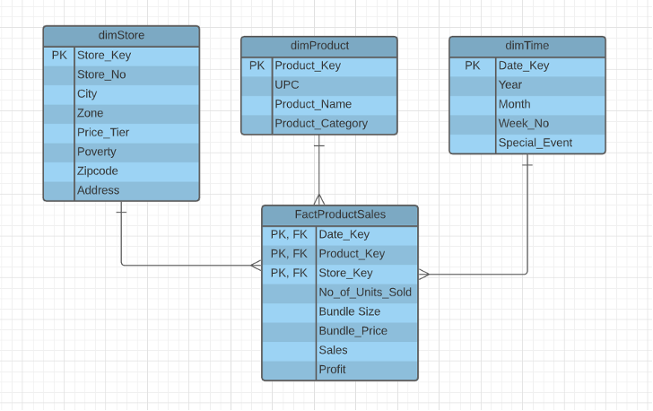
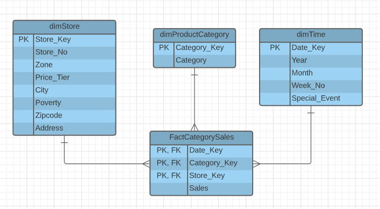
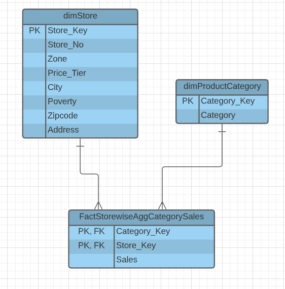

# Data Warehouse for Dominick's Fine Foods
The purpose of this project is to create a Data Warehouse for our client - Dominick's Fine Foods to provide them with an efficient, robust and fast means if querying the results to answer the below questions:

1. HOW ARE AVERAGE SALES OF A PRODUCT CHANGING BY STORE FROM 1995 - 1997?
2. WHAT ARE THE TOTAL SALES OF VARIOUS FOOD ITEMS ON NEW YEAR’S EVE OVER THE YEARS?
3. WHAT IS THE SALE OF DIFFERENT KINDS OF ALCOHOLIC BEVERAGES OVER HOLIDAY WEEKS?
4. WHICH IS THE MOST PROFITABLE DETERGENT BRAND AT A PARTICULAR STORE?
5. WHICH ARE THE BEST PERFORMING STORES FOR JEWELRY SALES WHERE MORE THAN 10% OF VISITORS ARE BELOW THE POVERTY LINE?

Using Kimball's approach of conformable Data Marts, we have used the Dimensional Modeling technique to create a STAR schema for designing the warehouse for the retail store chain. By creating the Information Package diagrams, we decided on the Dimensions and the Fact tables that we would need to design the data marts that would compose our warehouse. 

We designed 3 Data Marts to make the querying process easy to understand, and make it return results at a super fast rate. The 3 Data Marts created to be able to efficiently answer the above questions are:

### 1. PRODUCT SALES DATA MART

### 2. PRODUCT CATEGORY SALES DATA MART

### 3. STOREWISE AGGREGATED CATEGORY SALES DATA MART

After deciding the data marts, we have planned the physical design, aggregation scheme, standardization scheme and indexing scheme. Then we have meticulously transformed the dataset, wherever required, to address the Data Quality issues. Primary issues addressed from the quality perspective include - dummy values in fields, absence of data values, cryptic/inconsistent/illegible values, misguided column names.

Following this, we have designed a comprehensive ETL plan to:

1. Extract the data from the data sources (.xlsx, .csv and .txt files) into temporary staging tables using SSIS, 
2. Clean and Transform the data to ensure quality, consistency and create derived columns for use in the warehouse
3. Load this transformed dataset from the final set of staging tables to the dimension and fact tables in the warehouse.

The data in the warehouse is finally utilized in SSAS, SSRS, a PowerBI Worksheet and a Tableau Worksheet to answer the initial business questions in a graphical, interactive and insightful format. 
